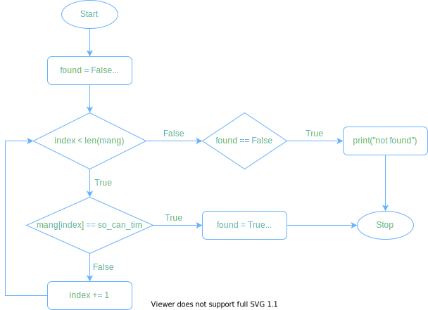
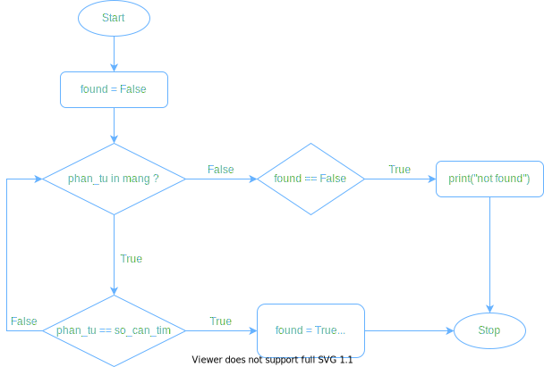

# Bài 4: Cỗ Máy Tìm Kiếm

> Thuật toán là một hướng dẫn **các bước cụ thể** để thực hiện một công việc nào đó.

- [x] Tìm kiếm tuần tự (Linear Search): ý tưởng, sơ đồ thuật toán, cài đặt
- [ ] Tìm kiếm nhị phân (Binary Search): ý tưởng, sơ đồ thuật toán, cài đặt
- [ ] Hàm (Function)

## Tài nguyên

- [[Lesson 4] Common Mistake + Flashcard](https://docs.google.com/presentation/d/e/2PACX-1vSIVfGh1S7kVmT0uuCcCHh2HHbAsoOD9iC58-Hf8LZzmfHFyuvIdmi5DPoB1TGCtCmdusgs5RErVfgE/embed?start=false&loop=false&delayms=3000&slide=id.gb61af6f9ef_1_83)
- [[Lesson 4] Preparation slide](https://docs.google.com/presentation/d/e/2PACX-1vQ7merIUe4zP9PnNa9xuvlJq_DrgZUaQWKtYL2CxWkEu1VKsIOBgaQYA6NCdZvllfgwJH7AOR3j6gZN/embed?start=false&loop=false&delayms=3000&slide=id.gb4103d2256_3_320)
- [[Lesson 4] Final slide](https://docs.google.com/presentation/d/e/2PACX-1vRaplNGdh38_4pg7UMfNV0V2GGAHLpdnqvU4QhKbxFC6jaxTLAVKNIW1h4lccNsJK45WDL2I6dVvhX2/embed?start=false&loop=false&delayms=3000&slide=id.gb4103d2256_3_320)
- [[SUM 21] CS 101 - Thầy ơi, thầy đi đâu thế! (Phiên bản chưa sắp xếp)](https://scratch.mit.edu/projects/481099537/)
- [[SUM 21] CS 101 - Searching Algorithm simulation](https://scratch.mit.edu/projects/553779257)
- [[SUM 21] CS 101 - Lucky Luke selection sorting](https://scratch.mit.edu/projects/481274546/)
- [[SUM 21] CS 101 - Thầy ơi, thầy đi đâu thế! (Phiên bản sắp xếp)](https://scratch.mit.edu/projects/481099413/)
- [Khái niệm Thuật toán](https://www.powtoon.com/embed/dC5wiRKAnKf/)

## Tìm kiếm tuần tự (Linear Search)

## Tìm kiếm tuần tự (Linear Search)

### Ý tưởng
1. Đi qua từng phần tử trong mảng
2. ___ Nếu giá trị của phần tử hiện tại = giá trị cần tìm thì:
3. ______ In ra màn hình "đã tìm được". Đi đến bước 5.
4. In ra màn hình "không tìm được".
5. Kết thúc

### Sơ đồ thuật toán

1. Sử dụng vòng lặp `while`



2. Sử dụng vòng lặp `for`



### Cài đặt

1. Sử dụng vòng lặp `while`

```Python
found = False
index = 0
while index < len(mang):
    if mang[index] == so_can_tim:
        found = True
        print("found it")
        break
if found == False:
    print("not found")
```

2. Sử dụng vòng lặp `for`

```Python
found = False
for phan_tu in mang:
    if phan_tu == so_can_tim:
        found = True
        print("found it")
        break
if found == False:
    print("not found")
```