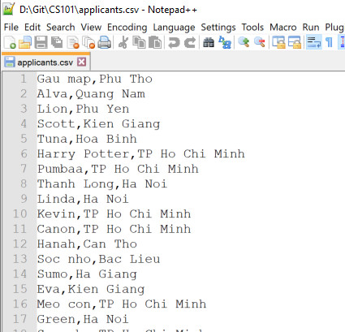

# Bài 6: Ai Sẽ Nhận Vaccine Trước

- [x] [Lưu trữ dữ liệu](#l%C6%B0u-tr%E1%BB%AF-d%E1%BB%AF-li%E1%BB%87u): ổ cứng (HDD, SSD), RAM
- [x] [Đọc dữ liệu từ ổ cứng](#%C4%91%E1%BB%8Dc-d%E1%BB%AF-li%E1%BB%87u-t%E1%BB%AB-%E1%BB%95-c%E1%BB%A9ng): open(), readlines()
- [x] [Ghi dữ liệu vào ổ cứng](#ghi-d%E1%BB%AF-li%E1%BB%87u-v%C3%A0o-%E1%BB%95-c%E1%BB%A9ng): open(), write()
- [x] [Phạm vi (Scope)](#ph%E1%BA%A1m-vi-scope): local variable, global variable

## Tài nguyên

- [[Lesson 6] Common Mistake + Flashcard](https://docs.google.com/presentation/d/e/2PACX-1vS1A8pgy0yinHD2U05SFKvGS6AyTvfos1U4ahnBgwM_OXG_EWcRD0JxS7ysrIsHuE_yAYelPoAB6ow0/embed?start=false&loop=false&delayms=3000&slide=id.gb61af6f9ef_1_83)
- [[Lesson 6] Preparation slide](https://docs.google.com/presentation/d/e/2PACX-1vTZUt4FaaB3dPnF0MZ8GZMYKiT3uoTwm5M_UYPGM5_FhD4LI4V4x7mQLskuTVyHT3pYzagrhn0wqnim/embed?start=false&loop=false&delayms=3000&slide=id.ge5d5a056b8_0_0)
- [[Lesson 6] Final slide](https://docs.google.com/presentation/d/e/2PACX-1vQZntyksgWbKsQD5eOwkyodPwpcs_3w58uVUpARukKd3iyiDNBsazvbMDA3cKIDktS48cr4lY_rgc-0/embed?start=false&loop=false&delayms=3000&slide=id.gb3b8b90c2c_0_705)
- [[SUM 21] CS101 - Tìm đồ xứ RAM](https://scratch.mit.edu/projects/555219197)
- [[Lesson 6] Tóm tắt nội dung bài học](https://www.youtube.com/watch?v=z0QR-cZ4nc8)

## Lưu trữ dữ liệu

- Dữ liệu được lưu trong đĩa cứng (hard disk) hoặc RAM (bộ nhớ tạm thời) **dưới dạng nhị phân**.
- Chỉ có **code, dữ liệu đã lưu, hình ảnh và âm thanh được lưu trên đĩa cứng**. Chúng tồn tại vĩnh viễn.
- Những dữ liệu lưu trong **biến, mảng,etc. được lưu trong RAM**. Chúng sẽ biến mất khi chương trình kết thúc.
- Để đo lường **số lượng dữ liệu có thể lưu trữ** (như: dung lượng ổ cứng, RAM, ổ USB, thẻ nhớ, etc.) người ta dùng các đơn vị: **Byte** (B), **Kilobyte** (KB), **Megabyte** (MB), **Gigabyte** (GB), **Terabyte** (TB).
    - 1 Byte = 8 bits. Mỗi bit (binary digit) lưu được một kí tự nhị phân.
    - 1 KB = 2^10 B (= 1024 Bytes)
    - 1 MB = 2^10 KB
    - 1 GB = 2^10 MB
    - 1 TB = 2^10 GB

Ví dụ:
- một máy tính có **RAM 8GB** có nghĩa là RAM của máy tính đó lưu được **tối đa** 8 GB (= 8.2^1000 kí tự nhị phân). Dung lượng này được phục vụ cho việc **lưu trữ tạm thời** khi chạy chương trình. **Khi chương trình kết thúc** (đóng cửa sổ của chương trình):
    - các dữ liệu tạm thời này sẽ được xoá khỏi RAM và biến mất.
    - RAM được giải phóng, có thêm dung lượng để lưu trữ tạm thời cho các chương trình khác.
- một máy tính có **ổ cứng 256GB** có nghĩa là ổ cứng của máy tính đó lưu được **tối đa** 256 GB (=256.2^1000 kí tự nhị phân). Dung lượng này được phục vụ cho việc **lưu trữ vĩnh viễn** (lưu file hình ảnh, âm thanh, code, etc.). **Ổ cứng chỉ được giải phóng khi ta xoá file**.

### Phân biệt các loại ổ cứng (HDD, SSD) và RAM

| tiêu chí so sánh | ổ cứng (HDD) | ổ cứng (SSD) | RAM |
|--|--|--|--|
| loại lưu trữ | vĩnh viễn | vĩnh viễn | tạm thời |
| tốc độ đọc/ghi | chậm nhất | nhanh gấp 2-4.5 lần HDD | rất nhanh, gấp khoảng 100.000 lần HDD |
| giá thành | rẻ nhất | khá đắt | rất đắt |
| giải phóng bộ nhớ | xoá file | xoá file | đóng/tắt chương trình |

## Đọc dữ liệu từ ổ cứng

Để đọc dữ liệu từ file ta dùng một trong hai cách sau:

- **Cách 1:** sử dụng câu lệnh `with`

```Python
with open("đường_dẫn_tới_file", "r") as file_reader:
    các_lệnh_thao_tác_trên_file
```
Hàm `open()` được dùng để đọc file. Nó cần 2 tham số:
1. `đường_dẫn_tới_file`: chỉ đường dẫn tới file cần đọc.
2. `"r"`: thông báo cho Python biết ta muốn mở file ở chế độ đọc ( read).

`file_reader` là biến đại diện cho file được mở. Tất cả thao tác trên file sẽ thông qua biến này. Chúng ta có thể đặt một tên biến bất kì thay cho tên `file_reader`, ví dụ: `fr`, `x`, `y`, etc.

- **Cách 2:** không sử dụng câu lệnh `with`
```Python
file_reader = open("đường_dẫn_tới_file", "r")
các_lệnh_thao_tác_trên_file
file_reader.close()
```
Trong cách 2 này, sau khi thao tác trên file ta cần phải sử dụng phương thức `close()` để đóng file lại.

| sử dụng `with` | không sử dụng `with` |
|--|--|
| các câu lệnh thao tác trên file phải nằm trong `with` (lùi đầu dòng) | các câu lệnh thao tác trên file nằm bên dưới và ngang cấp với câu lệnh mở file `open` |
| không cần phải đóng file sau khi dùng, câu lệnh `with` sẽ tự làm điều này. | phải đóng file sau khi dùng, sử dụng phương thức `close()`. Nếu không sẽ gây ra lỗi tràn bộ nhớ. |

**!!! Chú ý !!!**
- **Thonny dùng dấu slash `/` để ngăn cách các thư mục** chứ không phải dấu back slash `\` như Windows nên nếu đường dẫn tới file theo Windows là `D:\Git\CS101\applicants.csv` thì trong Thonny ta phải viết đường dẫn là `D:/Git/CS101/applicants.csv`.
- Nếu **file nằm cùng thư mục với code** Python thì ta chỉ cần gọi tên file là đủ.

### Đọc tất cả các ứng viên từ file

**Bài toán:** ta có file `applicants.csv` chứa tên các ứng viên:
- file được lưu trên ổ cứng, cùng thư mục với code Python.
- mỗi dòng của một file lưu thông tin về tên và tỉnh thành của ứng viên như hình dưới.



Đoạn code dưới đây sẽ đọc file `applicants.csv` và lưu thông tin của các ứng viên vào mảng `applicants`.

```Python
applicants = []
with open("applicants.csv", "r") as file_reader:
    lines = file_reader.readlines()
    for line in lines:
        applicant = line.strip()
        applicants.append(applicant)
```

Ở đây ta sử dụng:
- phương thức `readlines()` dùng để đọc tất cả các dòng trong file vào biến `lines`. Phương thức này trả về một mảng, mỗi phần tử của mảng là một dòng trong file `applicants.csv`.
- phương thức `strip()` để loại bỏ kí hiệu xuống dòng `\n` nằm ở cuối mỗi phần tử của mảng `lines`.

### Lập danh sách 20 ứng viên đầu tiên đến từ TP. HCM

**Bài toán:** Hãy đưa ra danh sách 20 ứng viên đầu tiên đến từ TP. HCM trong file `applicants.csv`.

**Phân tích:** Để có thể đưa ra danh sách 20 ứng viên đầu tiên đến từ TP. HCM ta cần làm các việc sau:
1. Đọc file `applicants.csv`, lưu thông tin tất cả các ứng viên vào mảng `applicants`. (đoạn code trên đã thực hiện việc này).
2. Lấy ra tất cả các ứng viên đến từ TP. HCM
    - Khởi tạo mảng `applicants_HCM`.
    - Đi qua các phần tử (ứng viên) của mảng `applicants`.
        - Với mỗi ứng viên ta cần tìm thành phố của ứng viên đó
        - sau đó kiểm tra nếu thành phố là `TP Ho Chi Minh` thì thêm ứng viên đó vào mảng `applicants_HCM`.
3. Lấy ra 20 ứng viên đầu tiên trong mảng `applicants_HCM`

Đoạn code dưới đây sẽ thực hiện việc 2 và 3.

```Python
# lay ra tat ca cac ung vien den tu TP.HCP
applicants_HCM = []
for applicant in applicants:
    city = applicant.split(",")[1]
    if city == "TP Ho Chi Minh":
        applicants_HCM.append(applicant)

# lay ra 20 ung vien dau tien
first_20_HCM = applicants_HCM[:20]
```

- Dòng số 3: `city = applicant.split(",")[1]` đầu tiên ta dùng phương thức `split()` để tách chuỗi gồm tên và thành phố của ứng viên thành mảng, sau đó lấy phần tử thứ hai của mảng (index = 1) lưu vào biến `city`.
- Ở dòng số 7: `applicants_HCM[:20]` trả về 20 phần tử đầu tiên của mảng `applicants_HCM`, sau đó ta lưu chúng vào biến `first_20_HCM` thông qua phép gán `=`.
- **!!! Chú ý !!!** Dòng số 7 sẽ gây lỗi nếu mảng `applicants_HCM` có ít hơn 20 ứng viên. Để tránh lỗi này ta thường dùng câu điều kiện như sau

```Python
if len(applicants_HCM) < 20:
    first_20_HCM = applicants_HCM
else:
    first_20_HCM = applicants_HCM[:20]
```

Chương trình đầy đủ:
```Python
# doc du lieu tu file vao mang applicants
applicants = []
with open("applicants.csv", "r") as file_reader:
    lines = file_reader.readlines()
    for line in lines:
        applicant = line.strip()
        applicants.append(applicant)

# lay ra tat ca cac ung vien den tu TP HCM
applicants_HCM = []
for applicant in applicants:
    city = applicant.split(",")[1]
    if city == "TP Ho Chi Minh":
        applicants_HCM.append(applicant)

# lay ra 20 ung vien dau tien
if len(applicants_HCM) < 20:
    first_20_HCM = applicants_HCM
else:
    first_20_HCM = applicants_HCM[:20]
```

## Ghi dữ liệu vào ổ cứng

Tương tự như đọc dữ liệu từ ổ cứng ta cũng có 2 cách để ghi dữ liệu vào ổ cứng: sử dụng và không sử dụng câu lệnh `with`.

- **Cách 1:** sử dụng câu lệnh `with`
```Python
with open("đường_dẫn_tới_file", "w") as file_writer:
    các_lệnh_thao_tác_trên_file
```
- **Cách 2:** không sử dụng câu lệnh `with`
```Python
file_writer = open("đường_dẫn_tới_file", "w")
các_lệnh_thao_tác_trên_file
file_writer.close()
```

**!!! Chú ý !!!**
- Tham số thứ hai của hàm `open()` phải nhận giá trị `"w"` để báo cho chương trình biết ta sẽ ghi nội dung vào file (write).
- Nếu file chưa tồn tại thì chương trình tự tạo ra một file mới.
- Nếu file đã tồn tại thì nội dung cũ sẽ bị xoá đi và nội dung mới được ghi vào.
- Nếu không sử dụng `with` thì phải gọi phương thức `close()` sau khi ghi file.
- Nếu đặt file vào cùng thư mục với file code (file `.py`) thì chỉ cần tên file là đủ.

**Ví dụ:** đoạn code sau sẽ ghi danh sách 20 ứng viên đầu tiên đến từ TP.HCM chứa trong biến `first_20_HCM` vào file `first_20_HCM.txt`. Mỗi dòng lưu thông tin một ứng viên.

```Python
with open("first_20_HCM.txt", "w") as file_writer:
    for applicant in first_20_HCM:
        file_write.write(applicant + "\n")
```
- Phương thức `write()` dùng để ghi nội dung của biến vào trong file.
- Ở dòng 3 ta phải `+ "\n"` vào biến `applicant` để xuống dòng.

## Phạm vi (Scope)

- Tất cả các **biến được khởi tạo trong hàm** thì có thể được truy cập từ bên trong hàm. Chúng là các **biến cục bộ** (local variable).
- **Trong các hàm khác nhau, có thể khởi tạo các biến trùng tên** vì dù chúng cùng tên nhưng được khởi tạo trong các hàm khác nhau nên chúng được cấp phát các bộ nhớ khác nhau.
- Tất cả các biến được khởi tạo trước câu lệnh định nghĩa hàm `def` đều có thể được truy cập từ bên trong hàm. Chúng là các **biến toàn cục** (global variable).
- **!!! Chú ý !!!** Nếu trong hàm có khởi tạo một biến cục bộ trùng tên với biến toàn cục thì:
    -  **tất cả** các câu lệnh sử dụng tên biến này sẽ truy cập đến giá trị của biến cục bộ.
    - **nếu có** câu lệnh sử dụng tên biến này **đặt trước câu lệnh khởi tạo** biến cục bộ, **chương trình sẽ báo lỗi** chứ không truy cập đến giá trị của biến toàn cục.

```Python
name = "Chi"
def say_hi_1():
    print("Hi " + name)

def say_hi_2():
    name = "Tuan"
    print("Hi " + name)

def say_hi_3():
    name = "Thao"
    print("Hi " + name)

say_hi_1()  # Hi Chi
say_hi_2()  # Hi Tuan
say_hi_3()  # Hi Thao
```

Trong đoạn code trên ta có 3 biến cùng tên `name`.
- Biến `name` ở dòng đầu tiên được khởi tạo trước các câu lệnh định nghĩa hàm `def` (dòng 2, 5, 9) nên nó là biến toàn cục (global variable).
- Biến `name` ở dòng thứ 6 được khởi tạo ở bên trong hàm `say_hi_2()` nên nó là biến cục bộ của hàm `say_hi_2()`, do đó chỉ có thể truy cập được từ bên trong hàm này.
- Biến `name` ở dòng thứ 10 được khởi tạo ở bên trong hàm `say_hi_3()` nên nó là biến cục bộ của hàm `say_hi_3()`, và cũng chỉ có thể truy cập được từ bên trong hàm này.

Trong ba hàm trên:
- hàm `say_hi_1()` không có khởi tạo biến `name` nên biến global sẽ được sử dụng.
- hàm `say_hi_2()` và `say_hi_3()` đều khởi tạo biến `name` nên biến local của chúng sẽ sử dụng.