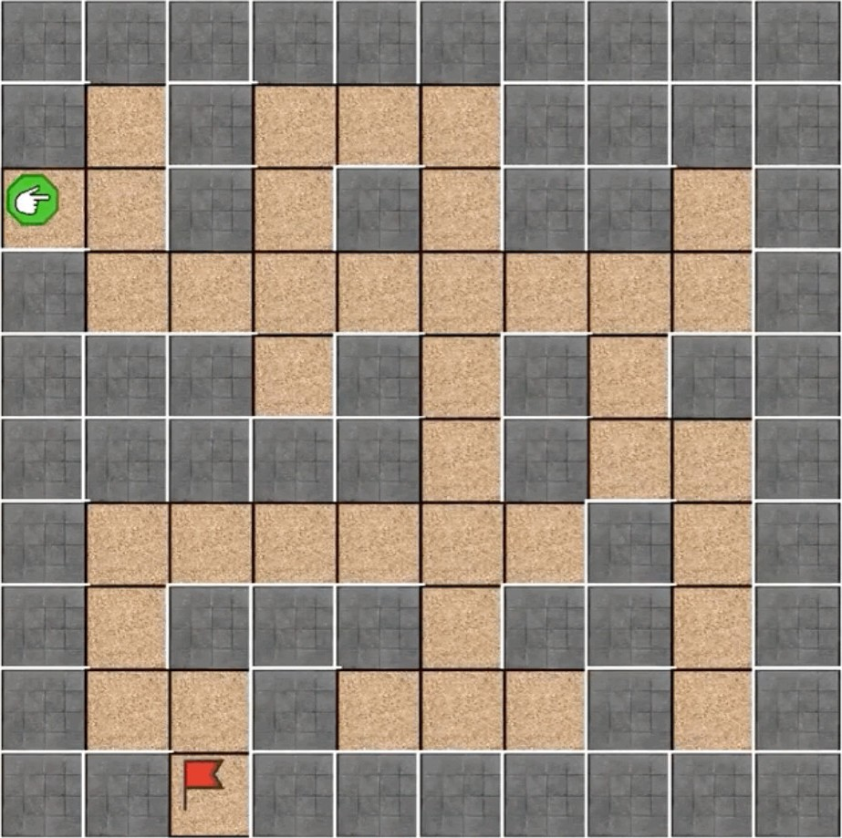

# Bài 7: Giải Mã Mê Cung

- [x] [Tìm kiếm theo chiều sâu (DFS)](#1-t%C3%ACm-ki%E1%BA%BFm-theo-chi%E1%BB%81u-s%C3%A2u-depth-first-search)
- [x] Cấu trúc dữ liệu:
    - [x] [Ngăn xếp (stack)](#21-ng%C4%83n-x%E1%BA%BFp-stack)
    - [x] [Hàng đợi (queue)](#22-h%C3%A0ng-%C4%91%E1%BB%A3i-queue)
    - [x] [Từ điển (dictionary)](#23-t%E1%BB%AB-%C4%91i%E1%BB%83n-dictionary)
- [x] [Tìm kiếm theo chiều rộng (BFS)](#3-t%C3%ACm-ki%E1%BA%BFm-theo-chi%E1%BB%81u-r%E1%BB%99ng-breadth-first-search)

## Tài nguyên

- [[Lesson 7] Common Mistake + Flashcard](https://docs.google.com/presentation/d/e/2PACX-1vQzxayWSYlusJKF4ck20bldTH9PcOfFLBWY6mOBE8HvHdeKjDgaxbIsKHifoc2rNBEsLBS8k8IU0zB2/embed?start=false&loop=false&delayms=3000&slide=id.gb61af6f9ef_1_83)
- [[Lesson 7] Preparation slide](https://docs.google.com/presentation/d/e/2PACX-1vRoUpxp3llaul9tO4Q-q-8RKdUJ5e1m604B1amMwKLEwXnBvrwYEksqP9K8nDMxkE1PlIH96AVTugjg/embed?start=false&loop=false&delayms=3000&slide=id.ge5d5a056b8_0_0)
- [[Lesson 7] Final slide](https://docs.google.com/presentation/d/e/2PACX-1vRewSXmND2fH9BRe1t1W4hJmW2o8lIU-HLOSwwwyIQhRun3rLFHbYSoFieEXfiqRPaLmdPnsUz1YjQ-/embed?start=false&loop=false&delayms=3000&slide=id.gc1c2dc763d_1_0)
- [[SUM 21] CS101 - Trẩu và Tre ở sân bay](https://scratch.mit.edu/projects/556876796/)
- [[SUM 21] CS101 - Giải mã mê cung manual](https://scratch.mit.edu/projects/493904924/)
- [[SUM 21] CS101 - Giải mã mê cung](https://scratch.mit.edu/projects/493741831/): DFS, BFS
- [[Lesson 7] Hướng dẫn cài đặt Pygame trên Thonny](https://www.youtube.com/watch?v=fSvHeLfE9yY)
- [[Lesson 7] Tóm tắt nội dung bài học](https://www.youtube.com/watch?v=ICsYgywXVwA)

## 1. Tìm kiếm theo chiều sâu (Depth First Search)

**Bài toán:** Chúng ta cần tìm đường đi **từ lối vào đến lối ra** của một mê cung như hình dưới.



**Ý tưởng:** ([slide 22](https://docs.google.com/presentation/d/e/2PACX-1vRewSXmND2fH9BRe1t1W4hJmW2o8lIU-HLOSwwwyIQhRun3rLFHbYSoFieEXfiqRPaLmdPnsUz1YjQ-/embed?start=false&loop=false&delayms=3000&slide=id.gc1079d7cf4_0_18))
1. Chúng ta đi theo một nhánh cho đến khi tìm được đường ra hoặc hết đường.
2. Nếu hết đường thì quay lại cho đến khi gặp nhánh mới, sau đó quay lại bước 1.


**Thuật toán DFS:**
1. Đến điểm xuất phát.
2. Ghi vị trí hiện tại vào hộp `đã-đi-qua`. *(Các vị trí khác nhau sẽ được đánh dấu bởi các số khác nhau.)*
3. Nhìn xung quanh theo thứ tự **trên - dưới - trái - phải** xem có **vị trí chưa đánh dấu** hay không?
    - Nếu có, đưa (các) vị trí đó vào hộp `sẽ-đi`.
4. Lấy ra **số trên cùng** (*được đưa vào cuối cùng*) trong hộp `sẽ-đi`, đi tới vị trí trong số đó. Sau đó, thực hiện bước 2.
5. Thuật toán kết thúc khi đến được đích, hoặc không còn vị trí để đi đến (hộp `sẽ-đi` không còn phần tử nào để lấy ra).

**!!!Chú ý!!!** Vị trí chưa đánh dấu là vị trí:
- có thể đi đến được.
- chưa được lưu trong hộp `đã-đi-qua` và hộp `sẽ-đi`.

**Cài đặt:**
- Để cài đặt thuật toán BFS ta cần sử dụng cấu trúc dữ liệu [ngăn xếp (stack)](#21-ng%C4%83n-x%E1%BA%BFp-stack), vào trước ra sau.
- Mã nguồn: [DFS.py*](DFS.py), [L7_DFS.py](L7_DFS.py), [L7_DFS_Turtle.py](L7_DFS_Turtle.py)

**Nhận xét:**
- Nếu mê cung có lối ra, thuật toán DFS sẽ **luôn tìm được** lối ra.
- Nếu mê cung có nhiều lối ra, thuật toán DFS **chỉ tìm được một lối ra**, và **không biết** được đó là đường đi dài nhất hay ngắn nhất.

## 2. Cấu trúc dữ liệu

### 2.1. Ngăn xếp (Stack)

**Khái niệm:**
- Ngăn xếp là một cấu trúc dữ liệu theo nguyên tắc thiết kế **vào sau ra trước** (Last In First Out - **LIFO**).
- Ngăn xếp có hai thao tác chính:
    - thêm phần tử vào ngăn xếp *(ở vị trí trên cùng)*, gọi là **push**.
    - lấy phần tử *(ở vị trí trên cùng)* ra khỏi ngăn xếp, gọi là **pop**.

(xem [slide 84](https://docs.google.com/presentation/d/e/2PACX-1vRewSXmND2fH9BRe1t1W4hJmW2o8lIU-HLOSwwwyIQhRun3rLFHbYSoFieEXfiqRPaLmdPnsUz1YjQ-/embed?start=false&loop=false&delayms=3000&slide=id.gbfd97ff75c_0_15))

**Lập trình:**
- Khởi tạo ngăn xếp: `stack = []`
- Thêm phần tử `item` vào ngăn xếp (**push**): `stack.append(item)`
- Lấy phần tử *(ở vị trí trên cùng)* ra khỏi ngăn xếp (**pop**): `item = stack.pop()`

**!!! Chú ý !!!** Phương thức `pop()` sẽ trả về lỗi nếu `stack` rỗng.

### 2.2. Hàng đợi (Queue)

**Khái niệm:**
- Hàng đợi là một cấu trúc dữ liệu theo nguyên tắc thiết kế **vào trước ra trước** (First In First Out - **FIFO**)
- Hàng đợi có hai thao tác chính:
    - thêm phần tử vào hàng đợi (ở vị trí sau cùng), gọi là **enqueue**.
    - lấy phần tử (ở vị trí đầu tiên) ra khỏi hàng đợi, gọi là **dequeue**.

(xem [slide 110](https://docs.google.com/presentation/d/e/2PACX-1vRewSXmND2fH9BRe1t1W4hJmW2o8lIU-HLOSwwwyIQhRun3rLFHbYSoFieEXfiqRPaLmdPnsUz1YjQ-/embed?start=false&loop=false&delayms=3000&slide=id.gb840d41073_3_122))

**Lập trình:**
- Khởi tạo hàng đợi: `queue = []`
- Thêm phần tử `item` vào hàng đợi (**enqueue**): `queue.append(item)`
- Lấy phần tử *(ở vị trí đầu tiên)* ra khỏi hàng đợi (**dequeue**):
    - `item = queue.pop(0)` hoặc
    - `item = queue[0]; queue.remove(item)`

**!!! Chú ý !!!** Phương thức `remove()` cần một giá trị đầu vào, `item` và sẽ trả về lỗi nếu `item` không có trong `queue`.

### 2.3. Từ điển (Dictionary)

**Khái niệm:**
- Từ điển là một cấu trúc dữ liệu gồm các cặp khoá (**key**) và giá trị (**value**) được phân cách bởi dấu phẩy **,** và đặt trong đấu ngoặc kép **{}**.
- Từ điển thường được dùng để lưu các dữ liệu gồm nhiều thành phần thông tin như: bản ghi về học sinh, tình nguyện viên, etc.
- Các khoá trong từ điển là duy nhất, chúng không thể trùng nhau.

Ví dụ:
```Python
profile = {
    "name": "Chi",
    "job": "Hoc sinh",
    "grade": 7,
    "cities": ["Ha Noi", "Thai Binh"]
}
```

**Lập trình:**
- Khởi tạo: `tên_biến_từ_điển = {khoá_1 : giá_trị_1, khoá_2: giá_trị_2}`.
- Truy cập một giá trị (value) của khoá (key) trong từ điển: `tên_biến_từ_điển[khoá]`.

Ví dụ: trong biến từ điển `profile` ở trên.

```Python
profile["name"]  # Chi
profile["grade"]  # 7
profile["cities"].append("Bac Giang")
profile["cities"]  # "Ha Noi", "Thai Binh", "Bac Giang"
```

## 3. Tìm kiếm theo chiều rộng (Breadth First Search)

**Ý tưởng:**
1. Chúng ta đi đồng thời các nhánh (*cần có phép dịch chuyển tức thời của Songoku*) cho đến khi tìm được đường ra hoặc hết đường.
2. Nếu hết đường nhánh nào hết đường thì không thử tiếp nữa.


**Thuật toán BFS:**
1. Đến điểm xuất phát.
2. Ghi vị trí hiện tại vào hộp `đã-đi-qua`. *(Các vị trí khác nhau sẽ được đánh dấu bởi các số khác nhau.)*
3. Nhìn xung quanh theo thứ tự **trên - dưới - trái - phải** xem có **vị trí chưa đánh dấu** không?
    - Nếu có, đưa (các) vị trí đó vào hộp `sẽ-đi`.
4. Lấy ra **số dưới cùng** (*được đưa vào đầu tiên*) trong hộp `sẽ-đi`, đi tới vị trí trong số đó. Sau đó, thực hiện bước 2.
5. Thuật toán kết thúc khi đến được đích, hoặc không còn vị trí để đi đến (hộp `sẽ-đi` không còn phần tử nào để lấy ra).

**!!!Chú ý!!!** Vị trí chưa đánh dấu là vị trí:
- có thể đi đến được.
- chưa được lưu trong hộp `đã-đi-qua` và hộp `sẽ-đi`.

**Cài đặt:**
- Để cài đặt thuật toán BFS ta cần sử dụng cấu trúc dữ liệu [hàng đợi (queue)](#22-h%C3%A0ng-%C4%91%E1%BB%A3i-queue), vào trước ra trước.
- Mã nguồn: [BFS.py*](BFS.py)

**Nhận xét:** Giống như DFS, thuật toán BFS:
- **luôn tìm được** lối ra, nếu mê cung có lối ra.
- **chỉ tìm được một lối ra**, và **không biết** được đó là đường đi dài nhất hay ngắn nhất.